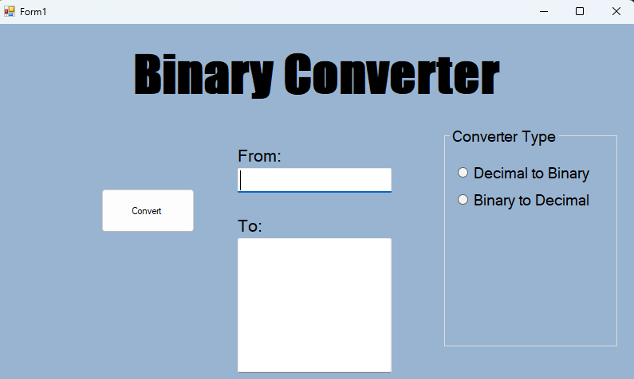

# Binary Converter 🖥️

A simple, lightweight Windows Forms application built with C# and .NET Framework to convert numbers between Decimal and Binary systems. This project was developed to practice Object-Oriented Programming (OOP) concepts and string manipulation in C#.

# 🚀 Features
Decimal to Binary: Converts decimal integers into a formatted 8-bit binary representation.

Binary to Decimal: Converts binary strings back into decimal integers.

Smart Formatting: Automatically pads binary results to 8-bit blocks and adds spaces between bytes for better readability.

Input Validation: Robust error handling using TryParse and try-catch blocks to prevent crashes on invalid inputs.

# 🛠️ Built With
C# - The core programming language.

.NET Framework - Used for Windows-specific desktop application development.

WinForms - The graphical user interface framework.

LINQ - For advanced string formatting and byte-grouping.

# 📸 Screenshots

# 💻 Code Snippet (Logic Highlight)
The application uses LINQ to ensure the binary output is always grouped into clean 8-bit segments:
~~~
string binaryNumber = Convert.ToString(decimalNumber, 2).PadLeft(8, '0');
txtTo.Text = string.Join(" ", Enumerable.Range(0, binaryNumber.Length / 8)
             .Select(i => binaryNumber.Substring(i * 8, 8)));
~~~

# ⚙️ How to Run

1. Clone the repository.

2. Open the .sln file in Visual Studio 2026.

3. Press F5 to build and run the application.
